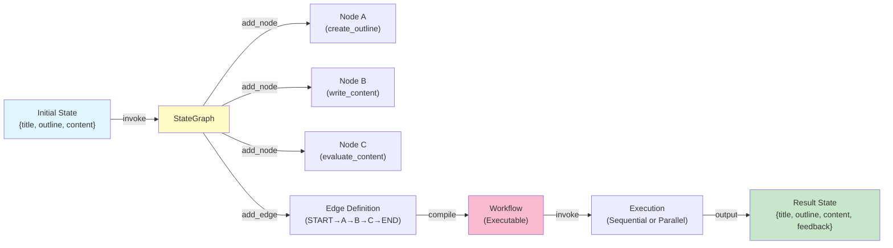

# Repository Exploration: LangGraph Structured Learning

## Executive Summary

**Purpose**: Self-contained learning repository for mastering LangGraph, a stateful workflow orchestration framework for building production-grade LLM-powered applications, AI agents, RAG systems, and multi-agent systems.

**Approach**: Hands-on Jupyter notebooks + conceptual documentation + best-practice patterns

**Learning Model**: Graph-based execution with persistent state — moving from stateless chains to stateful, controllable AI workflows

---

## 1. Project Purpose & Primary Workflows

### Learning Objectives
- Master **LangGraph fundamentals**: Graph, State, Nodes, Edges
- Understand **state management** in complex workflows
- Learn **sequential patterns** (prompt chaining)
- Learn **parallel execution patterns** with delta-based state merging
- Apply concepts to real-world LLM orchestration scenarios

### Workflow Demonstrations

#### 1a. **Prompt Chaining** (Sequential)
**File**: `prompt_chaining_workflow.ipynb` ★ RECOMMENDED START

```
Blog Title (input)
    ↓
[create_outline node] - Generates structure
    ↓ (pass state forward)
[write_content node] - Expands outline to full article
    ↓ (pass state forward)
[evaluate_content node] - Rates and critiques article
    ↓
Final State: {title, outline, content, feedback}
```

**Teaches**: 
- Basic StateGraph pattern
- Sequential node composition
- State persistence across steps
- LLM integration via ChatGroq
- Fundamental workflow compilation & invocation

#### 1b. **Parallel Execution with LLM** (Advanced)
**File**: `parallel_workflow/llm_eassy_workflow.ipynb`

```
Essay (input)
    ↓
START (split into parallel branches)
    ├→ [evaluate_language node] → scores + feedback
    ├→ [evaluate_clarity node]  → scores + feedback
    └→ [evaluate_analysis node] → scores + feedback
    ↓ (merge via Annotated reducer)
[final_evaluation node] - Aggregate scores, synthesize feedback
    ↓
Final State: {essay, avg_score, individual_scores, combined_feedback}
```

**Teaches**:
- Concurrent node execution
- Delta-based state merging (return only changed keys)
- Annotated reducers for aggregation (`Annotated[list, operator.add]`)
- Conflict resolution strategies
- Structured outputs from LLMs

#### 1c. **Parallel Execution without LLM** (Foundational)
**File**: `parallel_workflow/simple_workflow.ipynb`

```
Input
    ↓
START
    ├→ [node_a] - Compute strike_rate: 42
    ├→ [node_b] - Compute boundaries: 3
    ├→ [node_c] - Compute wickets: 7
    ↓ (shallow merge of deltas)
[downstream_node] - Process aggregated results
    ↓
Output
```

**Teaches**:
- Pure-Python parallel computation (no LLM complexity)
- Delta merging: `state.update(node_output)`
- State immutability without external dependencies
- Parallel control flow fundamentals

#### 1d. **Simple Node Patterns**
- **LLM_workflow.ipynb**: Single-node Q&A (question → LLM → answer)
- **workflow_1.ipynb**: Pure computation (weight + height → BMI calculation)

---

## 2. Key Dependencies & Build/Run Commands

### Core Dependencies

| Package | Purpose | Version* |
|---------|---------|----------|
| `langgraph` | Graph-based workflow orchestration | (latest) |
| `langchain_groq` | Groq API integration for fast LLM inference | (latest) |
| `pydantic` | Data validation & TypedDict schema definition | 2.12.5 |
| `python-dotenv` | Load `.env` file for API keys | 1.2.1 |
| `jupyter` | Interactive notebooks | (latest) |
| `ruff` | Linting & auto-formatting | 0.15.9 |
| `pytest` | Testing framework (configured, not yet in use) | 9.0.2 |

**Note**: `requirement.txt` contains 250+ packages due to accumulated environment dependencies. Core needs are much smaller.

### Setup Commands

```bash
# 1. CREATE ISOLATED ENVIRONMENT
python -m venv venv

# 2. ACTIVATE ENVIRONMENT
# Windows:
venv\Scripts\activate
# macOS/Linux:
source venv/bin/activate

# 3. INSTALL DEPENDENCIES
pip install -r requirement.txt

# 4. CREATE .env FILE (in project root)
# Content:
# GROQ_API_KEY=your_groq_api_key_here
```

### Run Commands

```bash
# Launch Jupyter Lab (interactive development)
jupyter lab

# Execute notebook from CLI (batch verification)
jupyter nbconvert --to notebook --execute --inplace <notebook>.ipynb

# Code quality checks
ruff check .                    # Lint all files
ruff format .                   # Auto-format

# Testing (future use)
pytest                          # Run all tests
pytest tests/test_my_module.py  # Single test file
```

### Important Notes
- **Python Version**: 3.11+ (tested with 3.11 and 3.12)
- **Virtual Environment**: Highly recommended; isolates project dependencies
- **API Keys**: Must be in `.env` file; notebooks load via `load_dotenv()`
- **Kernel Restart**: After dependency updates, restart Jupyter kernel

---

## 3. Project Conventions

### State Definition Pattern

**Template**:
```python
from typing import TypedDict

class BlogState(TypedDict):
    """Schema for blog generation workflow."""
    title: str           # Input: blog title
    outline: str         # Output from node_a
    content: str         # Output from node_b
    feedback: str        # Output from node_c
```

**Naming Convention**: `<PurposeName>State` (e.g., `BlogState`, `BMIState`, `EssayEvaluationState`)

**Why TypedDict**:
- Type-safe (IDE autocomplete, static type checking)
- Self-documenting (readers see all state keys)
- Immutable reference

### Node Implementation Pattern

**Template**:
```python
def node_name(state: StateType) -> StateType:
    """Single responsibility: describe what this node does.
    
    Args:
        state: Incoming state with keys [...required keys...]
        
    Returns:
        Updated state with keys [...changed keys...]
    """
    # 1. Extract needed values
    value_a = state.get("key_a")
    
    # 2. Perform work (computation, LLM call, tool execution, etc.)
    result = do_work(value_a)
    
    # 3. Return state update
    # For sequential: return full state
    # For parallel: return only changed keys (delta)
    return {"result_key": result}
```

**Naming Convention**: `snake_case_verb` (e.g., `create_outline`, `write_content`, `evaluate_content`)

**Best Practices**:
- **One responsibility per node** (single-purpose functions)
- **Return deltas in parallel** (only changed keys to prevent conflicts)
- **Return full state in sequential** (clarity that state flows forward)
- **Document state keys** (expected inputs, outputs)
- **Immutable**: Never mutate input; return new/updated dict

### Graph Construction Pattern

**Template**:
```python
from langgraph.graph import StateGraph, START, END

# 1. Create graph with state schema
graph = StateGraph(StateType)

# 2. Add nodes
graph.add_node("node_a", node_a_function)
graph.add_node("node_b", node_b_function)
graph.add_node("node_c", node_c_function)

# 3. Define edges (execution order)
# Sequential:
graph.add_edge(START, "node_a")
graph.add_edge("node_a", "node_b")
graph.add_edge("node_b", "node_c")
graph.add_edge("node_c", END)

# OR Parallel:
graph.add_edge(START, "node_a")
graph.add_edge(START, "node_b")
graph.add_edge(START, "node_c")
graph.add_edge("node_a", "downstream")
graph.add_edge("node_b", "downstream")
graph.add_edge("node_c", "downstream")
graph.add_edge("downstream", END)

# 4. Compile
workflow = graph.compile()

# 5. Execute
result = workflow.invoke(initial_state)
```

### LLM Integration Pattern

**Template**:
```python
from langchain_groq import ChatGroq
from dotenv import load_dotenv

# Load API keys from .env
load_dotenv()

# Initialize model (GROQ_API_KEY must be in environment)
model = ChatGroq(model="mixtral-8x7b-32768")  # or other Groq model

# In node function:
def my_llm_node(state):
    prompt = f"Your instruction: {state['context']}"
    response = model.invoke(prompt)
    return {"answer": response.content}  # Extract content attribute
```

**Key Points**:
- Always `load_dotenv()` before creating model clients
- `.env` file in project root with `GROQ_API_KEY=...`
- Use `response.content` to extract text from ChatGroq response
- Wrap LLM calls in try-except for production robustness

### Parallel Workflow State Merging Pattern

**When to return deltas**:
```python
def node_evaluates_language(state):
    # Only touch this node's responsibility
    score = evaluate_language(state["essay"])
    # Return ONLY changed key (delta)
    return {"language_score": score}

def node_evaluates_clarity(state):
    score = evaluate_clarity(state["essay"])
    return {"clarity_score": score}

# Merge via: state.update(node_a_output), state.update(node_b_output)
# Result: state has both language_score and clarity_score
```

**When using aggregation**:
```python
from typing import Annotated
import operator

class EvaluationState(TypedDict):
    essay: str
    scores: Annotated[list, operator.add]  # Aggregates via list concatenation

# Nodes return deltas with list values:
return {"scores": [42]}  # Automatically concatenated: [42, 85, 90]
```

### Documentation Style

- **Markdown files in Notes/**: Conceptual explanations with examples
- **Notebook cells**: Mix markdown + code + execution output
- **Inline comments**: Explain "why", not "what" (code is self-evident)
- **State diagrams**: Provided in Notes/Parallel_Workflow_Revision.md
- **Quick reference**: CLAUDE.md and REVISION_NOTES.md for fast lookup

---

## 4. Common Pitfalls & Environment Issues

### Pitfall 1: Module Import Errors
**Symptoms**: `ModuleNotFoundError: No module named 'langgraph'`

**Root Causes**:
- Virtual environment not activated
- Dependencies not installed
- Jupyter kernel using wrong Python interpreter

**Solution**:
```bash
venv\Scripts\activate                    # Windows
source venv/bin/activate                 # macOS/Linux
pip install -r requirement.txt
# In Jupyter: Kernel → Restart
```

### Pitfall 2: API Key Not Found
**Symptoms**: `NameError: GROQ_API_KEY not set` or similar

**Root Causes**:
- `.env` file missing from project root
- `.env` not loaded before model initialization
- Key name misspelled

**Solution**:
1. Create `.env` in project root:
   ```
   GROQ_API_KEY=your_actual_key_here
   ```
2. Ensure notebook calls `load_dotenv()` early
3. Verify key name matches exactly

### Pitfall 3: State KeyError During Execution
**Symptoms**: `KeyError: 'expected_key'` when running workflow

**Root Causes**:
- Initial state missing required keys
- Node returns wrong key names
- TypedDict schema not matched

**Solution**:
```python
# Before invoking:
initial_state = {
    "title": "My Blog",      # All required keys must be present
    "outline": "",           # Can be empty but must exist
    "content": "",
    "feedback": ""
}

result = workflow.invoke(initial_state)
```

### Pitfall 4: Parallel State Conflicts
**Symptoms**: Unexpected values in state after parallel execution

**Root Causes**:
- Returning full state instead of deltas
- Multiple nodes updating same key without merge policy
- Implicit assumptions about merge order

**Solution**:
- **Always return deltas** in parallel contexts: `return {"my_key": value}`
- **Document merge strategy**: Last-writer-wins vs. aggregation
- **Use Annotated reducers** for explicit aggregation semantics

### Pitfall 5: Notebook State Pollution
**Symptoms**: Code works then fails after code changes; inconsistent results

**Root Causes**:
- Kernel holding old variable definitions
- stale imported modules
- Execution order dependencies

**Solution**:
- Always restart kernel after:
  - Updating dependencies
  - Modifying imported modules
  - Redefining classes/functions
- Use `Kernel → Restart & Clear All Output` in Jupyter

### Pitfall 6: LLM Response Format Issues
**Symptoms**: `AttributeError: 'str' object has no attribute 'content'` or similar

**Root Causes**:
- API response format varies by provider
- Assuming `.content` attribute without checking

**Solution**:
```python
response = model.invoke(prompt)
# Debug: print(type(response), response)

# Safe extraction:
if hasattr(response, 'content'):
    text = response.content
else:
    text = str(response)
```

---

## 5. Architecture: Notebook Relationships & Patterns

### Learning Progression

```
START HERE
    ↓
prompt_chaining_workflow.ipynb (Sequential pattern, single responsibility)
    ↓ (Understand state flow)
    ↓
parallel_workflow/simple_workflow.ipynb (Parallel deltas without LLM)
    ↓ (Understand concurrency & merging)
    ↓
parallel_workflow/llm_eassy_workflow.ipynb (Parallel LLM + Annotated reducers)
    ↓ (Advanced state aggregation)
    ↓
LLM_workflow.ipynb, workflow_1.ipynb (Additional patterns)
    ↓
Apply to custom projects
```

### Pattern Families

| Pattern | File(s) | Key Takeaway | Complexity |
|---------|---------|--------------|-----------|
| **Sequential LLM** | prompt_chaining_workflow.ipynb | State flows linearly through LLM nodes | ⭐ |
| **Parallel Computation** | parallel_workflow/simple_workflow.ipynb | Multiple nodes run concurrently, merge deltas | ⭐⭐ |
| **Parallel LLM** | parallel_workflow/llm_eassy_workflow.ipynb | Parallel LLM calls with aggregation reducers | ⭐⭐⭐ |
| **Single LLM** | LLM_workflow.ipynb | Minimal graph (START → LLM → END) | ⭐ |
| **Pure Computation** | workflow_1.ipynb | Non-LLM node pattern (math, logic) | ⭐ |

### Shared Concepts Across Patterns

```
All Notebooks
    ├→ StateGraph(TypedDict) - State schema definition
    ├→ graph.add_node(name, function) - Register node
    ├→ graph.add_edge(src, dst) - Define control flow
    ├→ graph.compile() - Create executable workflow
    ├→ workflow.invoke(initial_state) - Execute
    └→ workflow.get_graph().draw_mermaid_png() - Visualize
```

### Differences by Pattern

| Aspect | Sequential | Parallel |
|--------|-----------|----------|
| **Node Returns** | Full state (clarity) | Deltas only (conflict prevention) |
| **Edges** | Linear chains | Multi-source to single destination |
| **Merge Strategy** | N/A (no merge) | Specified (default: dict update) |
| **State Consistency** | Guaranteed by order | Requires delta discipline |
| **Debugging** | Linear trace | State snapshot before merge |

---

## 6. Key Files Exemplifying Best Practices

### 1. [prompt_chaining_workflow.ipynb](prompt_chaining_workflow.ipynb)
**Demonstrates**: Canonical sequential pattern
- Clear state definition (`BlogState`)
- Each node has single responsibility
- Complete workflow end-to-end
- Markdown explanations integrated
- Calls `workflow.get_graph().draw_mermaid_png()` for visualization

**What to Copy**: Node structure, state management, error handling pattern

### 2. [parallel_workflow/simple_workflow.ipynb](parallel_workflow/simple_workflow.ipynb)
**Demonstrates**: Parallel execution without LLM complexity
- Delta returns (only changed keys)
- State merging logic (`state.update(...)`)
- Pure Python (no external dependencies)
- Clear visualization of concurrent execution

**What to Copy**: Delta merging pattern, parallel edge definition

### 3. [parallel_workflow/llm_eassy_workflow.ipynb](parallel_workflow/llm_eassy_workflow.ipynb)
**Demonstrates**: Advanced patterns
- Annotated reducers for aggregation
- Structured outputs from LLMs
- Parallel LLM calls with state merging
- Conflict resolution for shared state keys

**What to Copy**: Reducer syntax, structured output patterns, multi-LLM orchestration

### 4. [Notes/Langgraph_core_concepts.md](Notes/Langgraph_core_concepts.md)
**Purpose**: Conceptual foundation
- Graph definition and motivation
- State as shared memory
- Nodes as computation units
- Edges as control flow
- Why this pattern matters

**Use When**: You need to explain/understand "why" LangGraph (not "how")

### 5. [Notes/Parallel_Workflow_Revision.md](Notes/Parallel_Workflow_Revision.md)
**Purpose**: Advanced state management reference
- Why return deltas instead of full state
- Merge strategy options
- Conflict resolution patterns
- Best practices for parallel workflows
- State diagrams

**Use When**: Designing parallel workflows or debugging state conflicts

### 6. [CLAUDE.md](CLAUDE.md)
**Purpose**: AI assistant quick reference
- Frequently used commands (setup, run, lint)
- High-level architecture overview
- Development workflow tips
- Cursor/Copilot rules

**Use When**: You need quick command reference or project context refresh

### 7. [REVISION_NOTES.md](REVISION_NOTES.md)
**Purpose**: Notebook patterns summary
- Quick recap of each notebook's pattern
- Code snippets for common operations
- Implementation tips
- Where to look for specific examples

**Use When**: Reviewing patterns across notebooks or needing quick syntax reference

---

## 7. State Diagram: Core Architecture



---

## 8. Key Conventions Summary

### Naming
- **State classes**: `<Purpose>State` (e.g., `BlogState`)
- **Node functions**: `snake_case_verb` (e.g., `create_outline`, `evaluate_content`)
- **State keys**: `snake_case` (e.g., `article_title`, `outline_text`)

### Type Safety
- Always use `TypedDict` for state schemas
- Type hint node functions: `def node(state: MyState) -> MyState:`
- Use Pydantic models for structured LLM outputs when applicable

### Documentation
- Document state keys in TypedDict via class comments
- Explain node purpose in docstring
- Comment complex logic, not obvious code
- Use markdown cells liberally in notebooks

### Error Handling
- Wrap LLM calls in try-except
- Validate initial_state keys before invoke
- Log intermediate state for debugging
- Implement retry logic for transient failures

### Testing
- Test nodes in isolation (mock LLM calls)
- Validate state schema consistency
- Test merge logic for parallel workflows
- Perform end-to-end notebook validation

---

## 9. Actionable Next Steps for AI Agent

1. **Read CLAUDE.md first** (2 min) — Commands and architecture overview
2. **Study prompt_chaining_workflow.ipynb** (15 min) — Canonical example
3. **Review Langgraph_core_concepts.md** (10 min) — Conceptual foundation
4. **Check Parallel_Workflow_Revision.md** (5 min) — When working with concurrency
5. **Reference REVISION_NOTES.md** (1 min) — For quick pattern lookup
6. **Apply conventions**: Use existing patterns as templates for new workflows
7. **Validate via**: Running notebooks end-to-end, testing state schema, checking merge logic

---

**Last Updated**: May 7, 2026
**Repository**: langgraph-structured-learning
**Status**: Active learning repository with stable core patterns
